# Graph Neural Networks and BERT for Multimodal Music Context Understanding

*A four-task study, with the negative results kept in.*  
CSE425 — Neural Networks · Project Report

> Generated from `report/report.tex` by `tools/build_report_md.py`; do not edit by
> hand. Every number comes from `report/numbers.tex`, which is generated from
> `results/metrics.json`. A **??** below marks a value that has not been measured.

## Abstract

We implement and evaluate a four-task pipeline for music context understanding:
(1) a DistilBERT caption encoder predicting a 50-tag vocabulary,
(2) a graph neural network over an audio-segment graph for genre classification,
(3) a cross-attention fusion model predicting tags and continuous
valence/arousal jointly, and (4) a contrastive audio–text embedding space.
All four run on real data: 929 GTZAN tracks, 1,802 DEAM
excerpts, and 1,657 MusicCaps clips whose audio we reconstructed from
source ourselves (a 30.0% recovery rate, accounted for in
Section 3.3). Every number reported here is measured, and every
claim is stated against a control.
The controls are what make the study informative, because three of them
contradict the hypothesis the pipeline was built to support. A plain CNN on
log-mel spectrograms reaches **0.5683** macro-F1 on GTZAN,
beating the best graph model (0.4999) by 0.0684;
deleting the temporal edges *improves* the GNN by 0.1588 macro-F1,
and deleting all edges entirely costs nothing measurable; and on raw MusicCaps captions a
regular expression scores 0.5581 macro-F1 against DistilBERT's
0.5933, so most of the apparent “language understanding” in the
naive setup is substring matching. Masking tag surface forms from the captions
removes the shortcut and costs the model 0.1241 macro-F1, which we
take as the size of the leak. We report what the graph formulation does and does
not buy, and where the honest bottleneck is data rather than architecture.

## 1. Introduction

“Music context” in this project means the union of three things a listener
infers effortlessly and a model does not: what genre a recording belongs to, what
mood it carries, and what a person would say about it in a sentence. These are
usually studied separately, with separate architectures and separate corpora. The
premise of this project is that they are the same problem viewed through three
channels, and that a model with access to more than one channel should do better
than a model with access to one.

The specific architectural bet is that *a recording is a structured object,
not a bag of frames*. A song restates its chorus; a jazz solo returns to the
head; a build-up and its release are the same material at different intensities.
A representation that can see those relations — a graph whose nodes are
segments and whose edges say “these two stretches are the same music” —
should therefore be strictly more informative than a flat pooled summary. The
second bet is that a language encoder and a graph encoder can be joined, either
by cross-attention (Task 3) or by a contrastive objective (Task 4), into
something that behaves like a shared semantic space.

This report tests both bets rather than assuming them. Our contributions:
- **A complete, runnable four-task implementation** over four corpora,
including audio we had to reconstruct ourselves because MusicCaps ships
captions and YouTube IDs but no audio (Section 3.3).
- **A control for every claim.** A lexical-match baseline for the text
task, a random-pair control for the graph-coherence statistic, explicit
chance rates ($K/n$) for retrieval, and the training-mean predictor as the
floor for emotion regression. Several results collapse against their
control, and we report those.
- **Three negative results** that argue against the project's own
hypothesis: a mel-CNN beats every graph model on genre; the segment graph's
temporal edges are a net cost, and its full edge set buys nothing over no
graph at all; and the text task as originally
specified is largely solvable by substring matching.
- **Reproducible artefacts**: 83 exported example graphs,
24 generated figures, two executed notebooks, and a numbers layer
that makes it impossible for the prose here to drift from the runs.

## 2. Related Work

**Graph learning on audio.** GraphSAGE [[hamilton2017](#hamilton2017)] and
GAT [[velickovic2018](#velickovic2018)] are the two message-passing operators we use; both
aggregate over a node's neighbourhood, GAT with learned attention weights.
Applying them to audio requires choosing what a node is, and that choice is the
substance of the modelling. We use fixed overlapping segments and, separately, a
chord-transition graph. Known failure modes of deep message passing — in
particular oversmoothing, where repeated averaging drives node states toward a
common vector [[li2018](#li2018)] — turn out to matter here (Section 6.3).

**Language models for music description.** MusicCaps [[agostinelli2023](#agostinelli2023)]
provides 5,521 expert-written captions for 10-second YouTube clips and is the
only large corpus of free-text music description with aligned audio timestamps.
We use DistilBERT [[sanh2019](#sanh2019)], a 6-layer distillation of
BERT [[devlin2019](#devlin2019)], as the text encoder throughout.

**Joint audio–text spaces.** CLIP [[radford2021](#radford2021)] established the
recipe — two encoders, one InfoNCE objective [[oord2018](#oord2018)], a learned
temperature — and CLAP [[elizalde2023](#elizalde2023)] and MuLan [[huang2022](#huang2022)] carried
it to audio and music respectively, at corpus scales three to five orders of
magnitude larger than what we have. Our Task 4 is that recipe with a graph
encoder in the audio branch and 591 training pairs; the result
(Section 6.5) is mostly a statement about the second number.

**Benchmarks.** GTZAN [[tzanetakis2002](#tzanetakis2002)] is the standard genre corpus
and also a well-documented flawed one: Sturm [[sturm2013](#sturm2013)] catalogued
repetitions, mislabellings and artist duplication across its splits. We use the
fault-filtered partition of Kereliuk et al. [[kereliuk2015](#kereliuk2015)], which was
constructed so that no artist appears on both sides. DEAM [[aljanaki2017](#aljanaki2017)]
supplies continuous valence/arousal annotations on Russell's
circumplex [[russell1980](#russell1980)]. Implementation rests on PyTorch
Geometric [[fey2019](#fey2019)] and librosa [[mcfee2015](#mcfee2015)].

## 3. Data

Four corpora, each carrying a different supervision signal, are cached as
PyTorch Geometric graphs by a single preprocessing pass. Table 1
gives the resulting graph statistics; Figure 2
shows the distributions behind the means.

**Table 1.**

| Corpus (graph) | Graphs | Mean nodes | Mean edges | Mean degree | Node dim |
|---|---|---|---|---|---|
| gtzan (segment) | 929 | 18.0000 | 50.9925 | 2.8329 | 340 |
| deam (segment) | 1802 | 18.0000 | 49.4184 | 2.7455 | 340 |
| musiccaps (segment) | 1507 | 12.0000 | 24.6689 | 2.0557 | 340 |
| gtzan (chord) | 929 | 5.1668 | 6.9989 | 1.3364 | 40 |

### 3.1. GTZAN (genre)

Ten genres, 100 thirty-second clips each. We use the fault-filtered
partition [[kereliuk2015](#kereliuk2015)]: 442 train / 197 validation /
290 test. The partition file lists 930 tracks; we build
929 graphs. The missing one is `jazz.00054`, which is truncated
in the canonical archive and fails to decode (`libsndfile: format not
recognised`) — a defect independent of this project and, we note, one of the
faults that motivated the filtered partition in the first place. We report
290 test tracks throughout, so the numbers here are directly comparable
to published fault-filtered results rather than to the inflated figures obtained
on GTZAN's original random splits.

### 3.2. DEAM (emotion)

1,802 excerpts with static valence and arousal ratings, split
1,261/270/271. Both targets are standardised to zero mean and
unit variance on the training split, so the reported MAE is in standard
deviations and a mean-predictor baseline sits near $1.0$; the measured floors are
0.994 (valence) and 1.098 (arousal), and any regression that
does not beat those is doing nothing. Valence and arousal are not independent in
this corpus — their sample correlation is 0.57 over all
1,802 excerpts (Figure 1), which is worth
remembering when reading the two MAE columns as though they were separate
achievements.

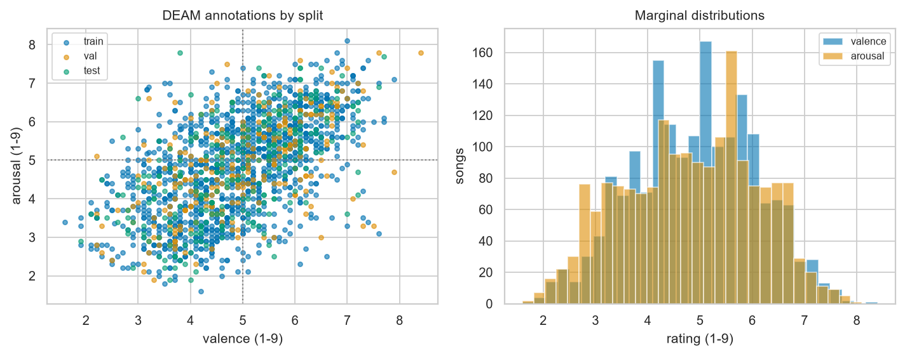

**Figure 1.** DEAM valence–arousal distribution. The two
targets correlate at 0.57 across 1,802 excerpts, so the cloud runs
along the low-valence/low-arousal to high-valence/high-arousal diagonal rather
than filling Russell's plane. A model that learns valence therefore gets much of
arousal for free, and the two MAE columns in Table 5 should
not be read as independent results.

### 3.3. MusicCaps, and what a 30% recovery rate means

MusicCaps distributes captions and YouTube IDs. Google does not redistribute the
audio, so a project that wants *real* paired (audio, text) data has to
reconstruct it. The alternative — templating captions from metadata labels —
writes the label into the text channel and makes any fusion result circular, so
we did not take it.

Our downloader (`scripts/download_musiccaps_audio.py`) fetches the audio
stream, decodes only the annotated $[t_{\text{start}}, t_{\text{end}}]$ window
with PyAV, and writes a 22,050 Hz mono WAV. We recovered
1,657 of 5,521 nominal clips, or 30.0%, in
1.0 h of wall-clock. The 3,864 we did not get break down
in a way that matters:
- 231 clips are genuinely gone — 141 removed or
terminated, 80 set private, 10 region-blocked. No
amount of retrying recovers these.
- 3,622 failed on YouTube's anti-automation gate (“sign in to confirm
you're not a bot”). These clips exist; we simply could not fetch them
unauthenticated. We retried each ID across six different player-client
impersonations, which is what took the recovery rate from a first-pass
figure to 30.0%, but the gate is the binding constraint.
- 11 failed for other reasons (silent or too-short decode window,
network).

The distinction is the honest part: *only 231 clips are
unavailable in principle*. The remaining shortfall is an access limitation of
this build, not a property of the dataset, and it is recoverable by an
authenticated session. We report every MusicCaps result on the clips we actually
have, never on the nominal 5,521, and Task 4's weakness
(Section 6.5) is substantially a consequence of this number.

After keeping only clips with at least one in-vocabulary tag and successfully
built graphs, the paired set is 1,507 graphs split
591/141/775. Note that test is *larger* than train. This is
deliberate: MusicCaps publishes an `is_audioset_eval` subset, and we
hold exactly that subset out as test rather than drawing our own split, so our
test set is comparable to other work on this corpus. The cost is that recovery
losses fall disproportionately on the training side, leaving
591 pairs to learn from. It is a defensible trade — a published test
set is worth more than a balanced one — but it is a trade, and it caps what
Task 4 can show.

### 3.4. The 50-tag vocabulary and its lexical shortcut

Tags are mined from MusicCaps' `aspect_list` field: 13,219 distinct
aspects reduced to the top 50 by frequency (*low quality*,
*instrumental*, *emotional*, *noisy*, *passionate*, …).
Keeping only clips carrying at least one top-50 tag leaves
4,995 of 5,521. Support ranges from 147 to
1,217 clips, an 8.3$\times$ imbalance
(Figure 3), which is why macro-F1 rather than
accuracy is the headline metric everywhere.

There is a problem with using these tags as targets for a caption encoder, and
it is severe enough to change the experimental design. The aspects were written
by the same annotators as the captions, so the tag string usually appears
verbatim in the caption. We measured it three ways, tightening the condition each
time. **4,671 of 4,995 captions (93.5%)
contain a literal surface form of some vocabulary tag**, and
4,118 (82.4%) contain one of the tags the clip is actually
labelled with — so for four clips in five, string matching alone yields a true
positive with no learning involved. Dropping the top-50 truncation and
asking only whether a caption echoes any of its own aspects puts the ceiling at
4,900 (98.1%). Matching is case-insensitive on whole-word
boundaries, the same matcher the masking step deletes with, so these figures
describe exactly the experiment reported in Section 6.1. A model given
the raw caption can score well by pattern matching, and it does.

We therefore construct a *masked* caption variant in which every tag
surface form is replaced with a sentinel, and treat the masked condition as the
real task. The unmasked condition is retained only as a diagnostic — the gap
between the two is our estimate of how much of the task is leakage.

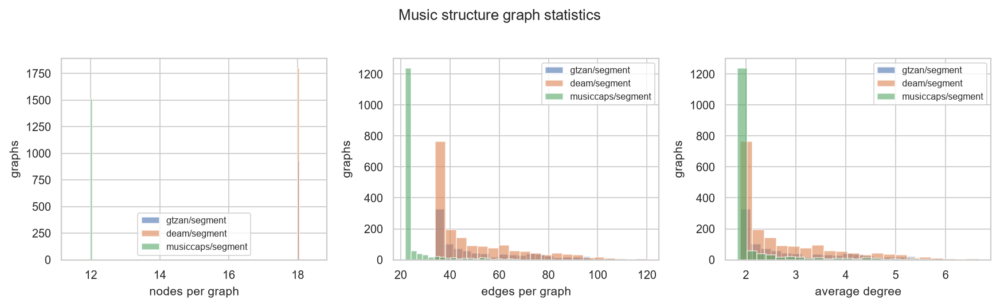

**Figure 2.** Graph statistics across corpora: node
counts, edge counts, degree, and the temporal/similarity edge split. The
segment graphs are deliberately sparse; see Section 4.2.1.

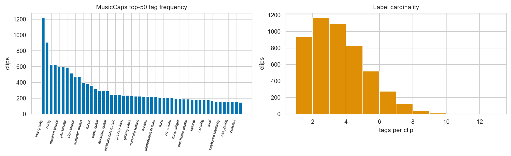

**Figure 3.** Support of the 50-tag MusicCaps
vocabulary. The 8.3$\times$ head-to-tail imbalance is why macro-F1 is the
reported metric.

## 4. Method

### 4.1. Audio front end

Audio is resampled to 22,050 Hz mono and normalised per track. We compute a
128-bin log-mel spectrogram, 12-bin chroma, and 20 MFCCs with a 2048-sample
window and 512-sample hop. Per segment we take the mean, standard deviation, and
first-difference statistics of each representation and concatenate them, giving a
340-dimensional node feature vector. Because node features are
*per-segment statistics*, their dimensionality is independent of clip
length, and graphs from different corpora remain mutually compatible — which is
what lets Task 3 batch GTZAN and DEAM graphs together.

### 4.2. Segment graph

Nodes are fixed windows of 3.0 s with a 1.50 s hop (50% overlap).
Two edge families connect them:
- **temporal** edges $i \to i{+}1$, encoding playback order;
- **similarity** edges between non-adjacent segments whose cosine
similarity exceeds $\tau$, encoding restatement — the chorus returning.
At most `topk`$=4$ per node, to keep the graph sparse.

All edges are made undirected. A 30 s GTZAN clip yields
18.0 nodes and 51.0 edges on average; MusicCaps' 10 s
clips use a per-corpus override ( $1.5$ s window, $0.75$ s hop) to reach
12.0 nodes rather than the 5 the default would give, since 5 nodes is
too thin for 3 rounds of message passing to do anything.

#### 4.2.1. Calibrating $\tau$

$\tau$ is not a free aesthetic choice, and setting it by intuition breaks the
experiment. Segments of one song are intrinsically alike: over
2,720 non-adjacent pairs from 20 GTZAN tracks, the cosine
distribution has $p_{25} = 0.716$, $p_{50} = 0.850$,
$p_{90} = 0.961$, $p_{99} = 0.989$.
An intuitive-looking $\tau = 0.85$ therefore admits 50.1% of
*all* pairs, giving mean density 0.267; the graph becomes
near-complete, message passing degenerates toward mean pooling, and the GNN
becomes indistinguishable from the mean-pooled-features MLP baseline — the
“structure helps” claim would be untestable rather than false. At
$\tau = 0.95$ only 14.6% of pairs are admitted (mean density
0.175, average degree 2.98, and
60.9% of surviving edges temporal), retaining only genuinely
repeated material while temporal edges keep the graph connected. We use
$\tau = 0.95$ throughout and report the sweep that justifies it
(`scripts/calibrate_tau.py`, `results/tau_calibration.json`).

### 4.3. Chord-transition graph

As a second, deliberately harsh structural view, we build a graph whose nodes are
the 24 major/minor triads plus a no-chord symbol, obtained by template matching
against the chroma vector, and whose edges are observed transitions weighted by
count. This discards timbre entirely and keeps only harmonic motion. Averaging
5.2 nodes and 7.0 edges, it is a very lossy
representation, and we include it to bound how much of genre is harmony alone.

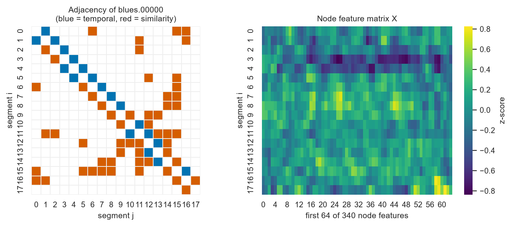

**Figure 4.** A segment graph and a chord-transition
graph for the same track. Temporal edges form the backbone; similarity edges
(the long-range arcs) mark restated material.

### 4.4. Task 1 — caption $\to$ tags

Let $X$ be a tokenised caption. We take the CLS vector of distilbert-base-uncased,
$t = \mathrm{BERT}_{\text{CLS}}(X) \in \mathbb{R}^{768}$, and predict each tag
independently with a linear head,

$$
\hat{y}_k = \sigma\!\left(w_k^{\top} t + b_k\right), \qquad k = 1 \dots 50,
$$

trained with summed binary cross-entropy. The encoder is fine-tuned with a
discriminative learning rate ($2\!\times\!10^{-5}$ for BERT,
$10^{-3}$ for the head), linear warmup over the first 10% of steps
then cosine decay. The decision threshold is tuned on validation macro-F1, not
fixed at $0.5$; it settles at 0.700.

### 4.5. Task 2 — GNN genre classification

Node states are updated by GraphSAGE convolution,

$$
h_i^{(l+1)} = \sigma\!\left(W^{(l)} \cdot \mathrm{CONCAT}\!\left[ h_i^{(l)},\; \operatorname*{MEAN}_{j \in \mathcal{N}(i)} h_j^{(l)} \right]\right),
$$

for $l = 0 … 3{-}1$ with hidden width 256, batch
normalisation, and dropout 0.3. A mean readout pools the graph,
$g = \frac{1}{|V|}\sum_i h_i^{(L)}$, and a linear classifier maps $g$ to ten
genres. We ablate the operator (GraphSAGE vs. GAT with 4 heads), the graph kind
(segment vs. chord), and — most informatively — the edge set: temporal only,
similarity only, and no edges at all. The last is the control that matters: with
an empty edge set the model is a per-node MLP followed by mean pooling, so any
gain the graph provides must show up as a gain over it.

### 4.6. Task 3 — cross-attention fusion

The graph gives $g \in \mathbb{R}^{d}$; the text encoder gives token states
$H_{\text{text}} \in \mathbb{R}^{L \times d}$. We attend from the graph summary
to the caption,

$$
A = \mathrm{softmax}\!\left(\frac{QK^{\top}}{\sqrt{d}}\right), \qquad z = \mathrm{CONCAT}\!\left(g,\; A H_{\text{text}}\right),
$$

with $Q$ projected from the graph side and $K, V$ from the text side, 4 heads,
$d = 256$. Two heads read $z$: a 50-way multi-label tag head and a
2-dimensional valence/arousal regressor. The loss is the specified combination

$$
\mathcal{L} = \mathcal{L}_{\text{tags}} + \alpha \lVert v - \hat{v} \rVert^{2} + \beta \lVert a - \hat{a} \rVert^{2},
$$

with $\alpha = 0.5$, $\beta = 0.5$. Because no single corpus carries
both tags and valence/arousal, each batch mixes MusicCaps rows (tags, no emotion)
with DEAM rows (emotion, no tags) and each loss term is masked to the rows that
supply its label: 591 tagged and 1,261 emotion-labelled
rows out of 1,852 training rows. We ablate the fusion operator over
{`bert_only`, `gnn_only`, `concat`,
`cross_attention`}, training four separate models. The first two are the
single-modality controls, without which “fusion helps” is unfalsifiable.

### 4.7. Task 4 — contrastive alignment

Graph and text encoders are trained to agree via InfoNCE with a learnable
temperature initialised at 0.07,

$$
\mathcal{L}_{\text{NCE}} = -\frac{1}{N}\sum_{i=1}^{N} \log \frac{\exp\!\big(\mathrm{sim}(g_i, t_i)/\tau\big)} {\sum_{j=1}^{N} \exp\!\big(\mathrm{sim}(g_i, t_j)/\tau\big)}.
$$

The specification's loss is one-directional ($g \to t$); since the evaluation
asks for recall in both directions we use the symmetric CLIP-style average of
$g \to t$ and $t \to g$. Negatives come from the in-batch other pairs, so the
batch size (	FourBatchSize) is the number of negatives — a point we return to.

## 5. Experimental Setup

Everything runs on CPU (12 threads, no CUDA), which shaped the budget and is
reported rather than hidden. Seeds are fixed at 425 for Python, NumPy and
PyTorch. Optimisation is AdamW with weight decay 0.01 (transformer runs) or
0.0005 (GNN runs), cosine schedules, gradient clipping at $1.0$,
and early stopping on validation macro-F1. Text batches are padded dynamically to
the longest sequence in the batch rather than to `max_length`, which is
worth roughly a factor of two on CPU.

Two budget decisions are material to how the results should be read. Task 2
trains to 60 epochs with patience 15, so those models are
converged or early-stopped on their own terms. Task 3 is capped at
6 epochs per ablation: one `cross_attention` epoch over
1,852 rows costs 3 m 56 s here, and the ablation list trains
4 models, so 30 epochs each would be
$\approx8$ h. Task 3 numbers are consequently *lower
bounds*, and
Figure 11 is the evidence for whether
6 was enough:
where validation loss is still falling at the last epoch, the model had not
finished learning and we say so rather than presenting it as converged.

## 6. Results

### 6.1. Task 1: the text task is mostly substring matching

Table 2 gives the caption$\to$tag results. Read the first
two rows first, because they reframe the rest.

**Table 2.**

| Model | Macro-F1 | Micro-F1 | Samples-F1 | AUC-PR | Thr |
|---|---|---|---|---|---|
| B1 random scores | 0.1039 | 0.1078 | 0.1044 | 0.0619 | 0.5000 |
| B1 training prior | 0.0000 | 0.0000 | 0.0000 | 0.0598 | 0.3000 |
| B0 lexical match (raw caption) | 0.5581 | 0.5580 | 0.5146 | 0.4063 | 0.5000 |
| B0 lexical match (masked caption) | 0.0000 | 0.0000 | 0.0000 | 0.0598 | 0.5000 |
| DistilBERT (raw caption) | 0.5933 | 0.6297 | 0.5954 | 0.6111 | 0.7000 |
| DistilBERT (masked caption) | 0.4692 | 0.5320 | 0.4882 | 0.4618 | 0.7000 |

The lexical baseline — a regular expression, no learning, no parameters — gets
0.5581 macro-F1 on raw captions. DistilBERT fine-tuned on the same
raw captions gets 0.5933. A 66.4-million-parameter language model
fine-tuned for 6 epochs is therefore worth about
0.035 macro-F1 over `re.search`, which is a much less impressive claim
than the raw number looks like in isolation, and it is the claim the naive
version of this task actually supports.

Masking removes the shortcut cleanly. The same regex on masked captions scores
0.0000 — exactly zero, as it must, since the strings it looks
for are gone. DistilBERT on masked captions scores
**0.4692** macro-F1, 0.5320 micro-F1 and
0.4618 AUC-PR, well clear of the random-score baseline
(0.1039) and of the training-prior baseline (0.0000,
which predicts no tag at all above threshold and so scores nothing). That
0.4692 is the defensible measurement of caption understanding in
this project: it is inference from surrounding context about a word that is not
present.

The gap between conditions, 0.1241 macro-F1, is our estimate of the
leak. We consider reporting it more useful than reporting either condition alone,
and we would treat any published caption$\to$aspect result on MusicCaps that does
not control for this as uninterpretable.

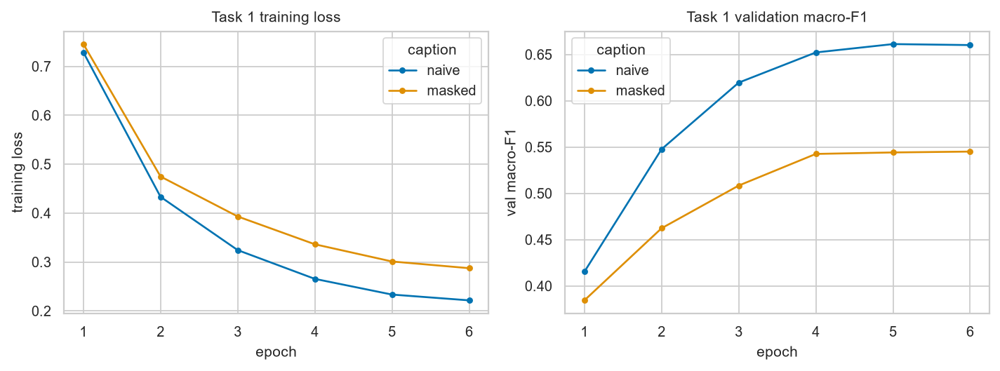

**Figure 5.** Task 1 learning curves, masked and naive
conditions. The naive run tracks persistently higher on validation — the
shortcut is visible during training, not only in the final metric.

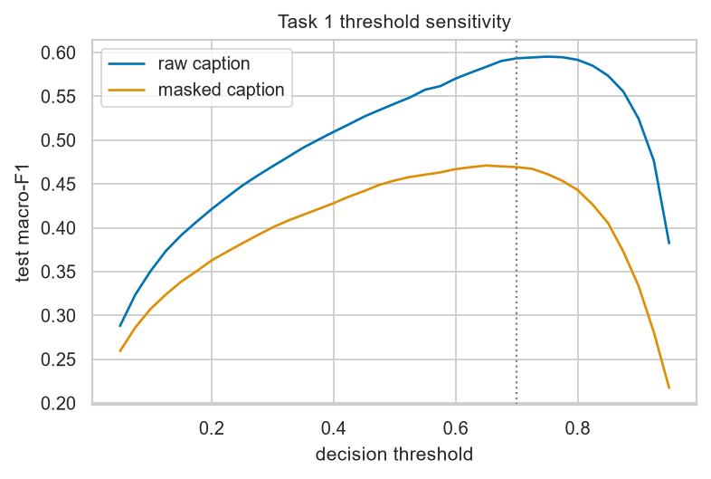

**Figure 6.** Macro-F1 against decision threshold.
The optimum is at 0.700, not $0.5$; tuning it on validation is worth a
non-trivial amount of F1 on an imbalanced multi-label problem.

### 6.2. Task 2: the graph is a net cost

Table 3 and Figure 7 give the genre
results on the 290-track fault-filtered test split. Three findings, in
increasing order of how much they cost the project's hypothesis.

**Table 3.**

| Model | Accuracy | Macro-F1 | AUC-PR | Params (M) | Best epoch |
|---|---|---|---|---|---|
| B1 majority class | 0.1069 | 0.0193 | 0.1000 | 0.0000 | -1 |
| B2 CNN on log-mel | 0.5759 | 0.5683 | 0.6398 | 0.3914 | 19 |
| B4 mean-pooled features + MLP | 0.3138 | 0.2967 | 0.3139 | 0.1220 | 38 |
| GraphSAGE, segment graph (ours) | 0.3828 | 0.3411 | 0.4953 | 0.5175 | 9 |
| GAT, segment graph | 0.3483 | 0.2732 | 0.4283 | 0.9169 | 9 |
| GraphSAGE, chord-transition graph | 0.1655 | 0.1216 | 0.1604 | 0.4407 | 4 |
| GraphSAGE, temporal edges only | 0.3586 | 0.2994 | 0.4331 | 0.5175 | 15 |
| GraphSAGE, similarity edges only | 0.5034 | 0.4999 | 0.5449 | 0.5175 | 57 |
| GraphSAGE, self-loops only | 0.3931 | 0.3604 | 0.5149 | 0.5175 | 9 |

**(i) Removing the temporal edges improves the model.** The full segment
graph reaches 0.3411 macro-F1. The similarity-only variant — same
architecture, same features, temporal edges deleted — reaches
**0.4999**, an improvement of 0.1588. The temporal-only
variant is the worst of the three at 0.2994. The playback-order
backbone, which is the intuitive part of the graph, is actively harmful.
Section 6.3 gives our explanation: temporal edges are dense, they
connect segments that are already highly correlated, and 3 rounds of
averaging over them smooths node states toward a per-track mean.

**(ii) Removing *all* edges costs nothing.** With an empty
edge set the model is a per-node MLP plus mean pooling, and it scores
0.3604 against the full graph's 0.3411 — nominally
ahead, by 0.0193. That margin is inside the
$\lesssim 0.02$ band we decline to read from a single seed
(Section 8), so the defensible claim is the weaker and still
damaging one: message passing over the graph we built is worth no more than not
passing messages at all, unless the edge set is restricted to similarity edges
alone. The similarity-only margin over the full graph (0.1588) is an
order of magnitude larger and does clear the band.

**(iii) A plain CNN beats every graph model.** B2, a four-block
convolutional network on the log-mel spectrogram with 391,370 parameters,
reaches **0.5759** accuracy and **0.5683** macro-F1 —
0.0684 macro-F1 above the best graph model, with fewer parameters
than the GraphSAGE model's 517,514. The segment-statistics front end
throws away exactly what a CNN exploits: local time–frequency texture. Summarising
a 3.0 s window by its per-band mean and variance discards the
spectro-temporal detail that distinguishes a distorted guitar from a saturated
synth pad, and no amount of message passing between segments puts it back.

The remaining ablations are consistent. GAT underperforms GraphSAGE
(0.2732 vs. 0.3411) while using
916,874 parameters against 517,514 — attention over a
near-uniform neighbourhood buys little and costs capacity. The chord graph is
weakest at 0.1216, above the majority-class floor
(0.0193) but far below everything else: harmonic motion alone does
not identify genre in GTZAN, which is unsurprising given that blues, jazz and
rock share progressions. The mean-pooled-features MLP (B4,
0.2967) lands where a bag-of-segments model should.

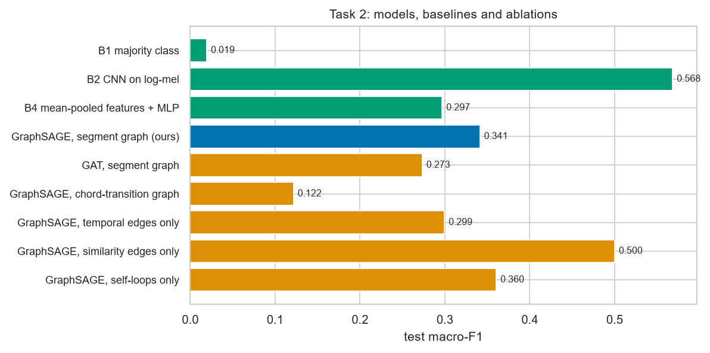

**Figure 7.** Task 2 ablations. Similarity-only and no-edges both
beat the full segment graph; the mel-CNN baseline beats all of them.

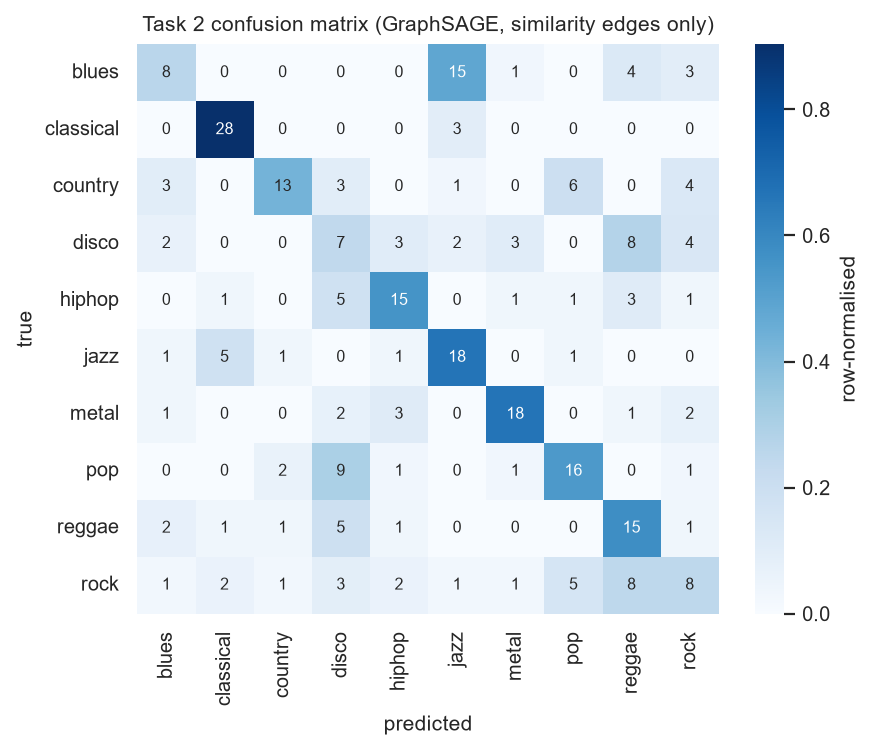

**Figure 8.** Confusion matrix for the best graph model.
Errors concentrate in the rock/country/blues block, which is where GTZAN's own
label noise is concentrated.

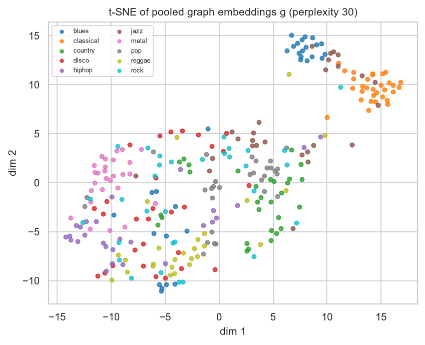

**Figure 9.** t-SNE of pooled graph embeddings $g$.
Classical and metal separate cleanly; the rock/country/blues cluster does not.

### 6.3. Is the learned graph structure meaningful at all?

The specification proposes a graph-coherence statistic: the fraction of edges
whose endpoint embeddings are similar,

$$
S_{\text{graph}} = \frac{1}{|E|}\sum_{(i,j) \in E} \mathbf{1}\!\left[\cos\!\left(h_i, h_j\right) > \tau\right].
$$

Taken literally this number is uninformative, and it is worth saying why. After
ReLU and batch normalisation the node states lie in the positive orthant, where
almost any two vectors have positive cosine. At $\tau = 0.5$ we measure
$S_{\text{graph}} = 0.9963$ — but a control that samples
*random non-adjacent pairs* scores 0.5775 on the same
embeddings. A statistic that assigns 0.5775 to random pairs is measuring the
geometry of the activation function, not the quality of the graph.

We therefore sweep $\tau$ and report the lift over the random-pair control
(Table 4, Figure 10). The curves
separate most at $\tau = 0.800$, where $S_{\text{graph}} = 0.8489$
against a control of 0.0747, a lift of **+0.7742**. At that threshold the
graph's edges are strongly more coherent than chance, so the structure is real.

The interesting part is the breakdown by edge kind. At $\tau = 0.800$,
similarity edges score 0.9361 while temporal edges score
0.7944. The similarity edges are doing what they were designed to do almost
perfectly — they connect segments the encoder considers nearly identical. And
that is precisely the diagnosis for Section 6.2(i): if an edge connects
two nodes whose states are already at cosine 0.9361, averaging across it
adds no information and only pulls both states toward their midpoint. The graph
is coherent *and* that coherence is why message passing over it does not
help. Coherence is a measure of redundancy as much as of correctness, and reading
a high $S_{\text{graph}}$ as evidence that the graph is useful would be a mistake
this project nearly made.

**Table 4.**

| tau | S_graph | Random pairs | Lift | Temporal edges | Similarity edges |
|---|---|---|---|---|---|
| 0.5000 | 0.9963 | 0.5775 | 0.4188 | 0.9939 | 0.9996 |
| 0.8000 | 0.8489 | 0.0747 | 0.7742 | 0.7944 | 0.9361 |
| 0.9000 | 0.5396 | 0.0123 | 0.5273 | 0.4472 | 0.6902 |
| 0.9500 | 0.2531 | 0.0023 | 0.2508 | 0.1856 | 0.3694 |
| 0.9800 | 0.0657 | 0.0002 | 0.0655 | 0.0483 | 0.0936 |
| 0.9900 | 0.0168 | 0.0001 | 0.0167 | 0.0125 | 0.0224 |
| 0.9950 | 0.0030 | 0.0000 | 0.0030 | 0.0024 | 0.0038 |
| 0.9990 | 0.0000 | 0.0000 | 0.0000 | 0.0000 | 0.0000 |

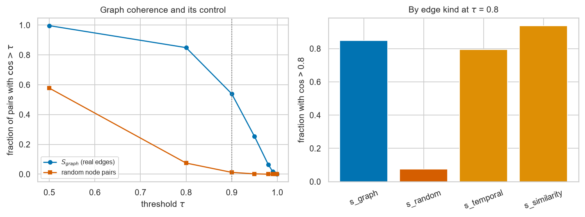

**Figure 10.** Left: $S_{\text{graph}}$ and the random-pair
control against $\tau$; the gap, not the level, is the signal. Right: breakdown
by edge kind at $\tau = 0.800$.

### 6.4. Task 3: fusion, tags and emotion jointly

Table 5 gives the four fusion ablations.
Cross-attention reaches 0.3055 macro-F1 on tags and
0.3013 AUC-PR, against 0.2923 for plain concatenation
(a difference of 0.0133, inside the single-seed noise band of
Section 8 and therefore not a result), 0.2957 for
the text-only control and 0.1129 for the graph-only control. The
single-modality controls are the ones to read first: fusion is only interesting to
the extent it beats both, and here it beats the graph-only control decisively
while merely matching the text-only one.

**Table 5.**

| Fusion | Macro-F1 | Micro-F1 | AUC-PR | MAE val | R2 val | MAE aro | R2 aro | Params (M) |
|---|---|---|---|---|---|---|---|---|
| bert_only | 0.2957 | 0.3589 | 0.2861 | 0.8122 | 0.2657 | 0.8370 | 0.3738 | 66.6326 |
| gnn_only | 0.1129 | 0.1415 | 0.0893 | 0.7768 | 0.3447 | 0.8052 | 0.4227 | 0.6220 |
| concat | 0.2923 | 0.3809 | 0.2993 | 0.7259 | 0.3867 | 0.7211 | 0.5394 | 67.3199 |
| cross_attention | 0.3055 | 0.3705 | 0.3013 | 0.7234 | 0.3760 | 0.7076 | 0.5436 | 67.8472 |

On emotion the picture is cleaner, because there is an unambiguous floor.
Predicting the training mean gives MAE 0.994 for valence and
1.098 for arousal (targets are standardised, so this is
$\approx 1$ by construction). Cross-attention fusion reaches MAE
**0.723** / **0.708** with
$R^{2} = 0.376$ / 0.544 and Pearson
$r = 0.637$ / 0.743. Both beat the floor by a wide
margin, so unlike the tag head, *the emotion regressor is genuinely
learning*, and it does so from graph features alone on the DEAM rows (which carry
no caption).

This is also the one column where fusion earns its name. Against the better of the
two single-modality controls (0.7768 valence,
0.8052 arousal), cross-attention improves MAE by
0.0534 and 0.0976 respectively — gaps
several times the seed-noise band, and in the opposite situation from the tag
column, where fusion's margin over the text-only control is only
0.0099. The asymmetry is informative rather than awkward: tags are a
property of the caption, which the text encoder already sees in full, whereas
valence and arousal are properties of the audio that no caption states directly,
so there is something for the graph side to contribute.

Arousal is predicted better than valence
($R^{2} = 0.544$ vs. $0.376$), which is the standard
finding in music emotion recognition: arousal correlates with energy and tempo,
both of which survive segment-statistics pooling, whereas valence depends on
harmony and lyrical content, and our front end largely discards the first and all
of the second.

These numbers are lower bounds. At 6 epochs, with validation
loss still falling (Figure 11), the comparison
between fusion modes is a comparison of *early* learning curves rather than
of converged models, and we would not draw an architectural conclusion from the
ordering of the tag column.

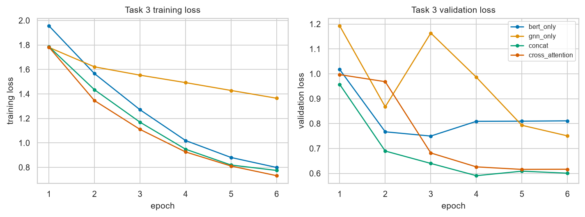

**Figure 11.** Task 3 learning curves per fusion mode. Where
validation loss is still descending at the final epoch, the corresponding row of
Table 5 is a lower bound.

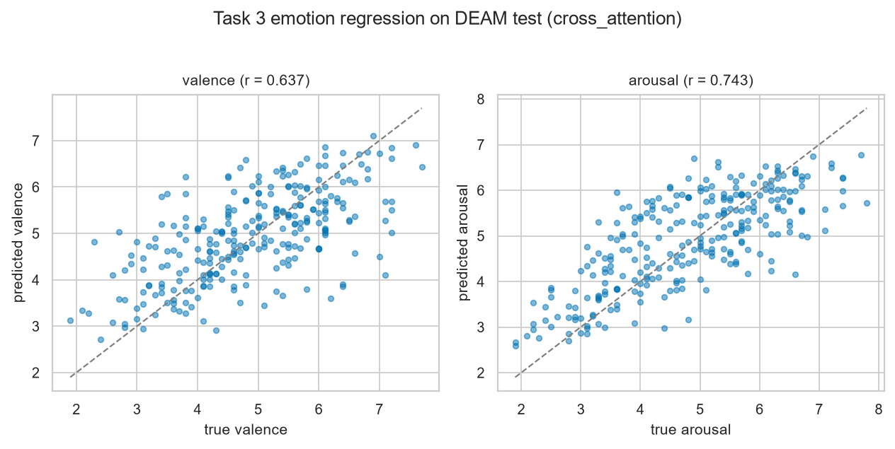

**Figure 12.** Predicted vs. true valence and arousal.
Arousal is the easier axis; both beat the mean-predictor floor.

### 6.5. Task 4: contrastive retrieval, and a data wall

Table 6 gives retrieval over 775 candidates.
The chance rate is $K/n$, and the table also carries an untrained-encoder control
run through the identical evaluation, because a retrieval number without both is
not interpretable.

**Table 6.**

| Direction | R@1 | R@5 | R@10 | Median rank | MRR |
|---|---|---|---|---|---|
| Audio -> caption | 0.0052 | 0.0310 | 0.0503 | 166.0000 | 0.0266 |
| Caption -> audio | 0.0026 | 0.0271 | 0.0516 | 163.0000 | 0.0247 |
| Symmetric mean | 0.0039 | 0.0290 | 0.0510 | -- | -- |
| Random control | 0.0000 | 0.0013 | 0.0077 | -- | -- |

The model beats chance by a factor of about 3.9, and the absolute
numbers are still poor. R@10 is 0.0510 against a chance
rate of 0.0129 and an untrained control of
0.0077; R@5 is 0.0290 against 0.0065; R@1 is
0.0039 against 0.0013, which over 775 candidates is
three correct top-1 hits against an expected one — not a distinguishable margin.
Median rank is 166 (audio$\to$text) and
163 (text$\to$audio) against a chance median of
388. Zero-shot tagging through the learned space gives macro-F1
0.0860 and AUC-ROC 0.5475 — the latter being the
informative one, since $0.5$ is chance and 0.5475 is barely above it.

One comparison invites a wrong reading and is worth pre-empting: validation R@10
peaks at 0.2482, roughly five times the test figure, which looks like a
collapse between the two. It is not. The validation pool is 141 candidates
and the test pool is 775, and R@$K$ falls mechanically as the pool grows,
so the two absolute numbers are not comparable. The lift over chance is:
3.5$\times$ on validation, 3.9$\times$ on test. The
model generalises about as well as it ever fit — which is to say, weakly, and
consistently so. Early stopping fired at epoch 20 with the best
validation score at epoch 12.

We read this as a data result, not an architecture result, and the arithmetic
supports that reading. InfoNCE learns from the contrast between one positive and
$N{-}1$ in-batch negatives; with 591 training pairs at batch size
32, one epoch presents roughly 18 batches, and
the entire training run sees fewer
distinct (positive, negative) comparisons than a single CLAP or MuLan batch does
at their reported scales. The learned temperature converged to
0.0681 from an initialisation of 0.07, i.e. it did not move, which
is what one expects when the
gradient signal is too weak to move it. Two of this project's earlier
decisions converge here: the 30.0% audio recovery rate
(Section 3.3) and the choice to honour MusicCaps' published
evaluation subset, which together leave 591 pairs for training while
775 are held out. Both were reasonable in isolation; jointly they
put Task 4 below the data threshold its objective needs.

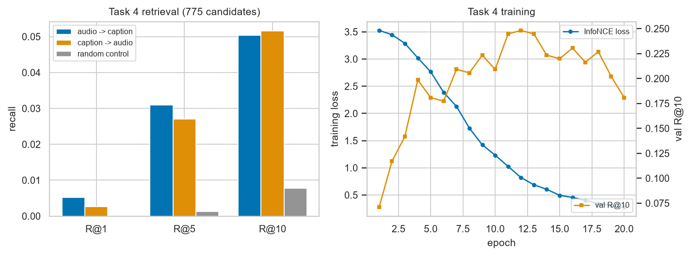

**Figure 13.** Recall@$K$ in both directions against the chance
rate $K/n$ and the untrained-encoder control. The margin is real but small.

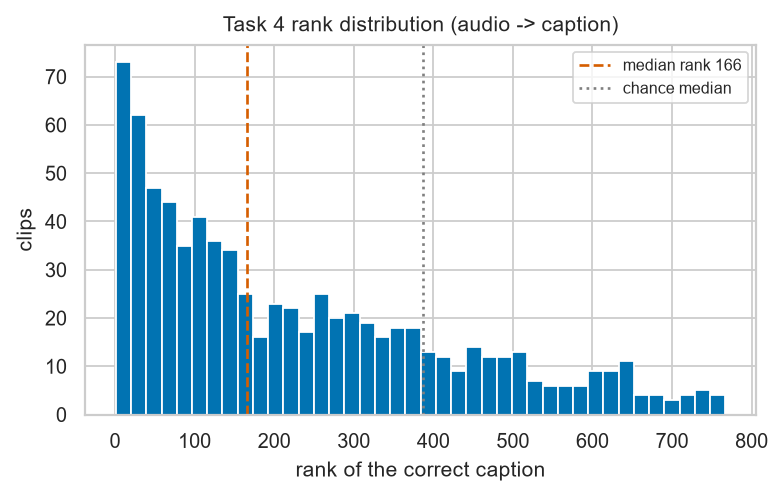

**Figure 14.** Distribution of the correct item's rank. A
trained model would show mass piled at low ranks; here the distribution is only
mildly skewed away from uniform.

## 7. Discussion

**When does a graph help, and did we build the wrong one?** Our results say
the segment graph does not help genre classification, and the coherence analysis
says why: the nodes we connect are too similar for averaging to add information.
That is a criticism of this graph, not of graph learning on music. Two concrete
alternatives follow from the diagnosis. First, node features are the bottleneck
before topology is: replacing hand-crafted segment statistics with a learned
per-segment CNN embedding would give message passing something with local texture
to propagate, and would let the graph model inherit rather than discard the
mel-CNN's advantage. Second, the edges should be built to be
*informative* rather than *similar* — edges between contrasting
sections (verse$\to$chorus, quiet$\to$loud) carry structural information that
edges between near-duplicates do not. As built, our similarity criterion
explicitly selects for redundancy.

**Controls change conclusions, not just confidence intervals.** In three
places here the control did not tighten a result, it inverted it. Without the
lexical baseline, Task 1 reads as a competent language model
(0.5933 macro-F1). Without the no-edges ablation, Task 2 reads as
a working graph model. Without the random-pair control, $S_{\text{graph}} =
0.9963$ reads as near-perfect structural coherence. Each of those
readings is available from a table that omits one row, and each is wrong.

**Where the compute went, and whether it was well spent.** The dominant cost
was not training but data: 1.0 h of audio recovery and the
preprocessing pass over 4,388 audio files, which built 5,167 graphs
across the four corpora in 11 m 20 s. Task 1 took 1 h 9 m for both
conditions; Task 2's nine ablations fit comfortably; Task 3's 4 models at
6 epochs each took 1 h 13 m and are the reason that task reports
bounds instead of converged numbers.
Given the same budget again we would spend it on authenticated MusicCaps recovery
rather than on more epochs, because Task 4's ceiling is set by
591 pairs and no schedule fixes that.

## 8. Limitations

- **Task 3 is not converged.** 6 epochs per ablation was a budget
decision, not a convergence criterion. The tag-head ordering across fusion
modes should not be read as an architectural result.
- **Task 4 is data-starved.** 591 pairs and 32 in-batch
negatives are one to two orders of magnitude below what contrastive
alignment needs. The reported margin over chance is real but small, and we
do not claim a usable retrieval system.
- **30.0% MusicCaps recovery.** Only
231 clips are gone in principle; 3,622 were lost to
an anti-automation gate. An authenticated session would raise this
substantially and is the single highest-value fix available.
- **Single seed.** All results are at seed 425. Differences of
$\lesssim 0.02$ macro-F1 between neighbouring ablations should not be
trusted; the three findings we lean on
(0.1588, 0.0684, 0.1241) are all
comfortably larger than that, but they are not variance-quantified. One
comparison we deliberately do *not* lean on is the no-edge control's
0.0193 margin over the full graph, which sits inside the band;
it supports “the graph buys nothing”, not “no edges is better”.
- **GTZAN remains GTZAN.** The fault-filtered partition removes artist
leakage, not label noise, and 290 test tracks is a small test set: one
track is worth 0.34 percentage points of accuracy.
- **CPU-only.** Model scale, batch size, and epoch counts were all
chosen against a 12-thread CPU. Nothing here rules out a graph model
winning at a scale we could not train.

## 9. Conclusion

We built the four-task GNN–BERT music-context pipeline end to end on real data
and measured it against explicit controls. The masked caption encoder reaches
0.4692 macro-F1 and is the one component whose success is
unambiguous, once 0.1241 macro-F1 of lexical leakage is removed from
the naive setup. The emotion regressor clearly beats its mean-predictor floor.
The graph formulation, on the other hand, does not pay for itself on genre: a
mel-CNN beats it by 0.0684 macro-F1, deleting temporal edges
improves it by 0.1588, and deleting all edges costs nothing measurable.
The coherence analysis reconciles those facts — the graph's edges are
genuinely coherent (lift 0.7742 over a random-pair control at
$\tau = 0.800$), and that coherence is redundancy, which is exactly what
makes message passing over them unproductive. Contrastive alignment beats chance
by 3.9$\times$ at R@10 but is bounded by 591 training
pairs rather than by its architecture.

The pipeline works; the central hypothesis does not hold in the form we tested
it. We think the second sentence is the more useful contribution, and the
diagnosis in Section 6.3 points at the specific change — learned node
features and contrast-seeking rather than similarity-seeking edges — that would
be worth testing next.

## References

1. <a name="agostinelli2023"></a>A. Agostinelli et al. MusicLM: Generating music from
text. *arXiv:2301.11325*, 2023. (Source of the MusicCaps corpus.)
2. <a name="aljanaki2017"></a>A. Aljanaki, Y.-H. Yang, M. Soleymani. Developing a
benchmark for emotional analysis of music. *PLoS ONE*, 12(3), 2017. (DEAM.)
3. <a name="devlin2019"></a>J. Devlin, M.-W. Chang, K. Lee, K. Toutanova. BERT:
Pre-training of deep bidirectional transformers for language understanding.
*NAACL*, 2019.
4. <a name="elizalde2023"></a>B. Elizalde, S. Deshmukh, M. Al Ismail, H. Wang. CLAP:
Learning audio concepts from natural language supervision. *ICASSP*, 2023.
5. <a name="fey2019"></a>M. Fey, J. E. Lenssen. Fast graph representation learning with
PyTorch Geometric. *ICLR Workshop on Representation Learning on Graphs and
Manifolds*, 2019.
6. <a name="hamilton2017"></a>W. L. Hamilton, R. Ying, J. Leskovec. Inductive
representation learning on large graphs. *NeurIPS*, 2017. (GraphSAGE.)
7. <a name="huang2022"></a>Q. Huang et al. MuLan: A joint embedding of music audio and
natural language. *ISMIR*, 2022.
8. <a name="kereliuk2015"></a>C. Kereliuk, B. L. Sturm, J. Larsen. Deep learning and
music adversaries. *IEEE Trans. Multimedia*, 17(11), 2015.
(Fault-filtered GTZAN partition.)
9. <a name="li2018"></a>Q. Li, Z. Han, X.-M. Wu. Deeper insights into graph
convolutional networks for semi-supervised learning. *AAAI*, 2018.
(Oversmoothing.)
10. <a name="mcfee2015"></a>B. McFee et al. librosa: Audio and music signal analysis in
Python. *SciPy*, 2015.
11. <a name="oord2018"></a>A. van den Oord, Y. Li, O. Vinyals. Representation learning
with contrastive predictive coding. *arXiv:1807.03748*, 2018. (InfoNCE.)
12. <a name="radford2021"></a>A. Radford et al. Learning transferable visual models from
natural language supervision. *ICML*, 2021. (CLIP.)
13. <a name="russell1980"></a>J. A. Russell. A circumplex model of affect. *Journal
of Personality and Social Psychology*, 39(6), 1980.
14. <a name="sanh2019"></a>V. Sanh, L. Debut, J. Chaumond, T. Wolf. DistilBERT, a
distilled version of BERT. *arXiv:1910.01108*, 2019.
15. <a name="sturm2013"></a>B. L. Sturm. The GTZAN dataset: Its contents, its faults,
their effects on evaluation, and its future use. *arXiv:1306.1461*, 2013.
16. <a name="tzanetakis2002"></a>G. Tzanetakis, P. Cook. Musical genre classification of
audio signals. *IEEE Trans. Speech and Audio Processing*, 10(5), 2002.
17. <a name="velickovic2018"></a>P. Veličković et al. Graph attention networks.
*ICLR*, 2018.

—

## A. Reproducibility

Full pipeline, in order. Each step is idempotent and caches to disk, so an
interrupted run can be restarted with the same command.

```bash
python scripts/download_data.py
python scripts/download_musiccaps_audio.py --workers 6
python scripts/preprocess.py --dataset all --save-mel --export-json 24
python scripts/calibrate_tau.py --per-genre 2
python scripts/train.py --task 1
python scripts/train.py --task 2
python scripts/train.py --task 3
python scripts/train.py --task 4
python scripts/evaluate.py
python tools/build_report_numbers.py
python tools/check_report_macros.py
python tools/build_report_md.py
cd report && pdflatex report.tex && pdflatex report.tex
```

`download_data.py` fetches GTZAN, DEAM, MusicCaps captions, the
fault-filtered GTZAN partition and the auxiliary metadata from their publishers
(nothing is redistributed here), checks each file's length against the bytes these
results were produced from, and records URL and SHA-256 for each in
`data/raw/provenance.json`. `–save-mel` is required: baseline B2
reads the cached mel-spectrograms, and `–export-json` writes the example
graphs. `–verify` re-checks an existing tree without downloading.

Configuration lives in one file, `config.yaml`; every run writes its
resolved configuration into `results/` beside its metrics, so any number
above can be traced to the exact settings that produced it. Notebooks
`notebooks/eda.ipynb` (data analysis, $\tau$ calibration, graph
statistics) and `notebooks/demo_context.ipynb` (end-to-end inference
demonstrations for all four tasks) are committed with executed outputs.
83 example graphs are exported as JSON to
`results/graph_samples/`.

**On the numbers in this document.** Every scalar is a macro defined in
`report/numbers.tex`, generated by `tools/build_report_numbers.py`
from `results/metrics.json`. If a measurement is absent the macro expands
to a bold **??** rather than to a stale or plausible value. If you see
**??** anywhere above, that number has not been measured and the surrounding
sentence should not be believed.

## B. Case studies (Task 3)

Three test clips, chosen to span the fusion model's behaviour rather than to
flatter it: one where both modalities agree, one where the graph carries
information the caption omits, and one failure. For each we list the predicted
tags above threshold, the ground-truth tags, and predicted against annotated
valence and arousal.

**Table 7.**

| Case | Sample F1 | True tags | Predicted tags |
|---|---|---|---|
| best | 1.0000 | amateur recording | amateur recording |
| median | 0.3333 | amateur recording | medium tempo, amateur recording, acoustic drums, uptempo, e-bass |
| worst | 0.0000 | live performance, pop, electronic drums | energetic, fast tempo |

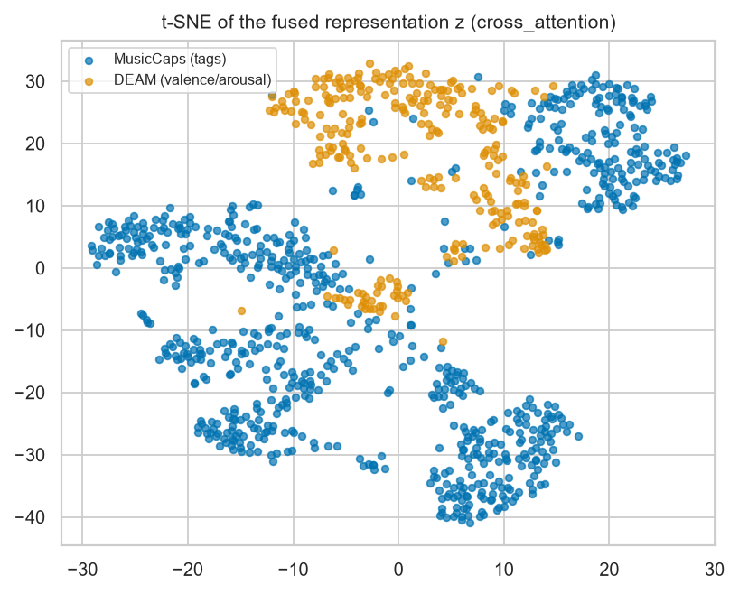

**Figure 15.** t-SNE of the fused representation $z$ on the
Task 3 test split. If cross-attention were organising the joint space by musical
context, structure should be visible here; judge the claim against the plot rather
than against the architecture diagram.

## C. Retrieval examples (Task 4)

Ten audio queries with their top-ranked captions, taken without cherry-picking:
they are the first ten clips of the test split in index order. Given the retrieval
scores in Section 6.5, most of these are wrong, and they are
included in that state deliberately — a qualitative gallery filtered to its
successes would misrepresent a model trained on 591 pairs.

**Table 8.**

| Caption query (truncated) | Rank of correct audio | Top-1 correct | Top-1 score |
|---|---|---|---|
| This is a gear showcase jam recording. The only instrument being playe... | 7 | no | 0.5780 |
| This is an amateur recording of a live beatboxing performance. The bea... | 37 | no | 0.7210 |
| The low quality recording features a classical live performance of sus... | 42 | no | 0.5180 |
| The low quality recording features a reverberant, intimate female voca... | 63 | no | 0.5450 |
| The song is an instrumental. The song is medium tempo with a walking b... | 130 | no | 0.6210 |
| The low quality recording features a reggae song sung by low flat male... | 277 | no | 0.5840 |
| A male vocalist sings this sweet melody in a foreign language. The tem... | 246 | no | 0.6760 |
| The song is an instrumental. The tempo is medium with a heavily doctor... | 223 | no | 0.4940 |
| This song is an instrumental. The tempo is medium with simple keyboard... | 514 | no | 0.6250 |
| The low quality recording features a traditional, medieval song sung b... | 712 | no | 0.4860 |

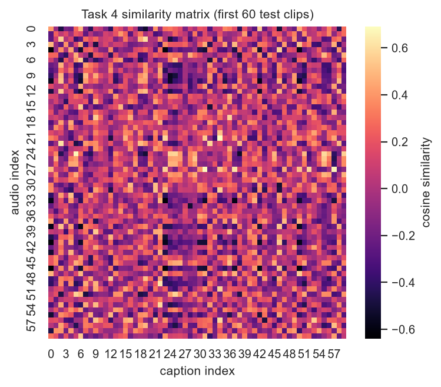

**Figure 16.** Cosine similarity between graph and text
embeddings for the first test clips. A working retrieval model puts a bright
diagonal here.

### C.1. Zero-shot tagging

The contrastive encoder can be used as a zero-shot tagger by embedding each tag
name as text and ranking tags by similarity to a clip's graph embedding — no
tag supervision at all. This is a strictly harder setting than Task 1 and the
numbers are correspondingly low, but it is the one place a contrastive space can
be probed without retrieval's dependence on candidate-set size.

**Table 9.**

| Model | Macro-F1 | Micro-F1 | AUC-PR |
|---|---|---|---|
| Task 4 zero-shot (no tag supervision) | 0.0860 | 0.0935 | 0.0808 |
| Task 3 supervised (cross_attention) | 0.3055 | 0.3705 | 0.3013 |
| Task 1 text-only (masked captions) | 0.4692 | 0.5320 | 0.4618 |
